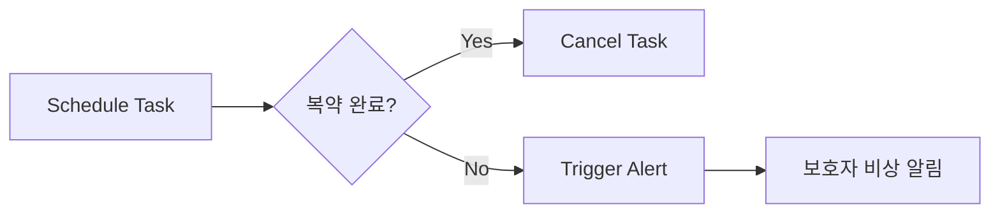

# 💊 Yak-Sok (약속)

> **"가장 확실한 안부 인사, 오늘의 복약 약속"**
>
> 시니어 맞춤형 복약 관리 및 응급 상황 감지 시스템 (Golden-Time Safety Line)

---

## 🌟 1. 기획 의도 (Project Motivation)

- **시니어 디지털 소외 해소**: 복잡한 UI를 배제하고, 건축/UX적 사고를 바탕으로 인지 부하를 최소화한 '원터치' 인터페이스를 제공합니다.
- **복약 = 생존 신호 (Life-Sign)**: 단순히 약을 먹었는지 체크하는 것을 넘어, 복약 여부를 사용자의 안부를 확인하는 가장 강력한 데이터로 활용합니다.
- **보호자의 안심 (Peace of Mind)**: 독거 노인 가구 증가에 대비하여, 미복약 시 보호자에게 즉각 알림을 보내는 사회적 안전망을 구축합니다.

---

## 🚀 2. 핵심 기능 (Key Features)

### 🔍 AI 기반 간편 등록

| 기능 | 설명 |
|------|------|
| **AI OCR 스캔** | 약 봉투나 처방전 사진 한 장으로 복용 스케줄을 자동 생성합니다 (Django + Vision API) |
| **STT 음성 인식** | 복잡한 타이핑 없이 음성만으로 복약 일정을 추가하고 수정합니다 |

### 🛡️ 골든타임 세이프티 라인 (Golden-Time Safety Line)

| 기능 | 설명 |
|------|------|
| **실시간 미복약 감지** | 정해진 시간으로부터 임계 시간 초과 시 비상 상황으로 간주합니다 |
| **단계별 비상 알림** | 시니어 본인 독촉 → 보호자 푸시 알림 → 최종 비상 연락처 긴급 호출 로직을 수행합니다 |

### 🎨 시니어 맞춤형 UX/UI

| 기능 | 설명 |
|------|------|
| **고대비/대형 인터페이스** | 시각 능력이 저하된 시니어를 위한 고대비 테마와 거대 버튼 레이아웃을 적용합니다 |
| **PWA (Progressive Web App)** | 별도 설치 없이 홈 화면 추가를 통해 앱처럼 사용 가능한 접근성을 제공합니다 |

---

## 🛠 3. 기술 스택 (Tech Stack)

| 구분 | 기술 스택 | 역할 |
|------|-----------|------|
| **Frontend** | Next.js (App Router) | 시니어/보호자 맞춤형 반응형 UI, PWA 구현 |
| **Backend** | Django REST Framework | 비즈니스 로직, RESTful API, 사용자 권한 관리 |
| **Async Task** | Celery + Redis | 비상 상황 감지(Safety Line) 및 알림 스케줄링 |
| **AI/ML** | OpenAI / Whisper | 처방전 OCR 분석 및 음성 명령 처리(STT) |
| **Infrastructure** | Docker, AWS | 컨테이너화된 배포 환경 및 서비스 모니터링 |

---

## 📂 4. 프로젝트 구조 (Project Structure)

```
yak-sok/
├── backend/                # Django REST Framework
│   ├── core/               # 프로젝트 메인 설정 (Settings, Celery Config)
│   ├── apps/               # 비즈니스 로직 앱 단위
│   │   ├── users/          # 사용자 계정 및 보호자 연결 관계
│   │   ├── medications/    # 복약 스케줄 및 OCR 파싱
│   │   └── alerts/         # 세이프티 라인 비상 알림 로직
│   └── manage.py
├── frontend/               # Next.js (TypeScript)
│   ├── src/
│   │   ├── app/            # 페이지 및 레이아웃 (App Router)
│   │   ├── components/     # 고대비/대형 UI 공통 컴포넌트
│   │   └── services/       # Backend 연동 API 함수
│   └── next.config.js
├── docker-compose.yml      # 인프라 통합 관리 (Backend, Frontend, Redis, DB)
└── README.md
```

---

## ⚙️ 5. 핵심 워크플로우: Safety Line



| 단계 | 설명 |
|------|------|
| **Schedule Task** | 복약 시간 등록 시 Celery에 n시간 후 비상 알림 작업 예약 |
| **Cancel Task** | 사용자가 복약 버튼 클릭 시 예약된 비상 알림 작업 즉시 취소 (Revoke) |
| **Trigger Alert** | 임계 시간까지 취소되지 않을 경우, Celery Worker가 보호자에게 비상 API 송출 |

---

## 👨‍💻 Developer

**Jongwoo Shin** (@jongwoo108)

- 📧 Contact: [본인의 이메일이나 연락처 추가]
- 🎯 Specialty: AI Engineer (LLM/RAG, CV), Architecture/UX Background