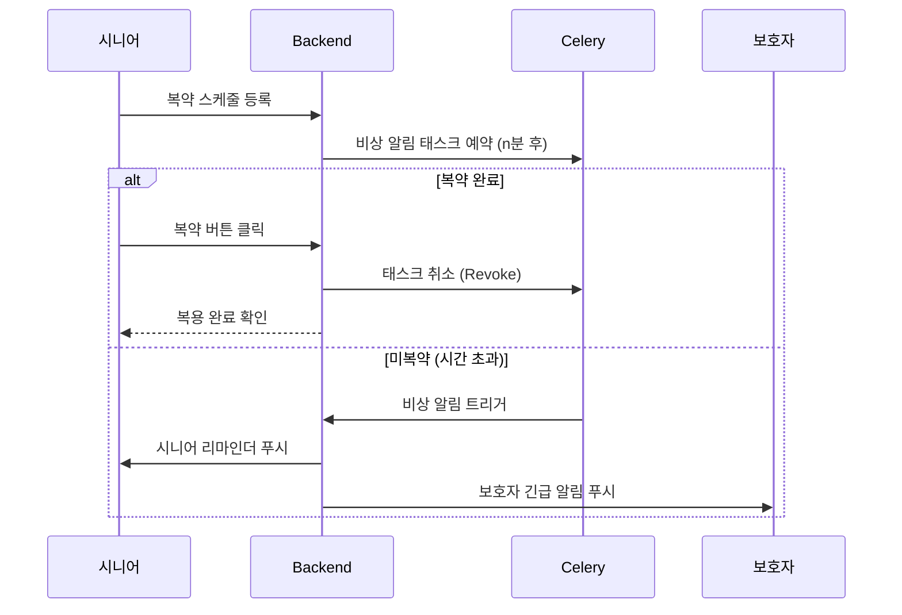

# 01. 프로젝트 구조 및 아키텍처

> 작성일: 2026-01-09

## 개요

Yak-Sok(약속)은 시니어 맞춤형 복약 관리 및 응급 상황 감지 시스템입니다.

### 핵심 가치
- **시니어 디지털 소외 해소**: 인지 부하 최소화, 원터치 인터페이스
- **복약 = 생존 신호**: 복약 여부를 안부 확인 데이터로 활용
- **보호자 안심**: 미복약 시 즉각 알림으로 사회적 안전망 구축

---

## 기술 스택

```
┌─────────────────────────────────────────────────────────┐
│                      Frontend                            │
│  Next.js 14 (App Router) + TypeScript + Zustand         │
│  PWA 지원 / 시니어 맞춤 고대비 UI                        │
└─────────────────────────────────────────────────────────┘
                           │
                           ▼
┌─────────────────────────────────────────────────────────┐
│                      Backend                             │
│  Django REST Framework + JWT 인증                        │
│  PostgreSQL + Redis                                      │
└─────────────────────────────────────────────────────────┘
                           │
                           ▼
┌─────────────────────────────────────────────────────────┐
│                   Async Tasks                            │
│  Celery + Redis (Safety Line 비상 알림)                  │
└─────────────────────────────────────────────────────────┘
                           │
                           ▼
┌─────────────────────────────────────────────────────────┐
│                   External APIs                          │
│  OpenAI (OCR/STT) + Firebase (Push Notifications)       │
└─────────────────────────────────────────────────────────┘
```

---

## 디렉토리 구조

```
yak-sok/
├── backend/                          # Django REST Framework
│   ├── core/                         # 프로젝트 설정
│   │   ├── settings.py               # Django 설정
│   │   ├── urls.py                   # URL 라우팅
│   │   ├── celery.py                 # Celery 설정
│   │   ├── wsgi.py / asgi.py
│   │   └── __init__.py
│   ├── apps/                         # 비즈니스 로직
│   │   ├── users/                    # 사용자 관리
│   │   ├── medications/              # 복약 관리
│   │   └── alerts/                   # Safety Line
│   ├── manage.py
│   ├── requirements.txt
│   └── Dockerfile
│
├── frontend/                         # Next.js (TypeScript)
│   ├── src/
│   │   ├── app/                      # 페이지 (App Router)
│   │   │   ├── page.tsx              # 홈
│   │   │   ├── login/                # 로그인
│   │   │   ├── medications/          # 약 관리
│   │   │   ├── profile/              # 프로필
│   │   │   ├── guardian/             # 보호자
│   │   │   └── alerts/               # 알림
│   │   ├── components/               # UI 컴포넌트
│   │   └── services/                 # API, Store
│   ├── public/
│   │   └── manifest.json             # PWA
│   ├── package.json
│   └── Dockerfile
│
├── docs/                             # 문서
├── docker-compose.yml                # 인프라
├── .env.example
├── .gitignore
└── README.md
```

---

## 주요 기능 흐름

### Safety Line (골든타임 세이프티 라인)



---

## 설계 원칙

1. **시니어 퍼스트**: 모든 UI 결정에서 시니어 사용성 최우선
2. **안전 우선**: Safety Line 로직은 절대 실패하지 않도록 설계
3. **확장성**: 마이크로서비스 전환 가능한 모듈 구조
4. **접근성**: WCAG 2.1 AA 수준 준수 목표
